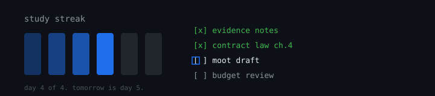

# Law Beyond




A productivity and social platform for law students — track streaks, manage study plans, monitor budgets, and connect with peers. Built with React, TypeScript, Tailwind CSS, Supabase, and M-Pesa payments.

## Features

- **Home Dashboard** — daily overview, quick actions, notifications
- **Streaks & Social Feed** — create posts, comment, like, build daily streaks
- **Study Planner** — manage tasks, assignments, and deadlines
- **Budget Tracker** — income/expense tracking, transaction history, spending charts
- **Push Notifications** — real-time web push alerts
- **Premium Subscriptions** — feature gating with M-Pesa STK Push payments
- **Auth** — email/password login and signup via Supabase
- **Responsive** — mobile bottom nav + desktop sidebar layouts

## Tech Stack

- **Frontend:** React 19, TypeScript 6, Vite 8, Tailwind CSS 4
- **Backend:** Supabase (Auth, PostgreSQL, Edge Functions in Deno)
- **Payments:** M-Pesa via Lipana API (STK Push)
- **Push Notifications:** Web push via Supabase Edge Functions
- **Error Tracking:** Sentry
- **Image Hosting:** Cloudinary

## Getting Started

### Prerequisites

- Node.js 18+
- A [Supabase](https://supabase.com) project
- A [Lipana](https://lipana.io) account (for M-Pesa)
- A [Sentry](https://sentry.io) project (optional)
- A [Cloudinary](https://cloudinary.com) account (optional)

### Install

```bash
npm install
cp .env.example .env
```

### Environment Variables

```env
VITE_SUPABASE_URL=your-project-url
VITE_SUPABASE_ANON_KEY=your-anon-key
VITE_SENTRY_DSN=your-sentry-dsn        # optional
VITE_CLOUDINARY_CLOUD_NAME=your-cloud  # optional
```

Get Supabase credentials from your [Supabase dashboard](https://supabase.com/dashboard) → Project Settings → API.

### Run

```bash
npm run dev
```

### Build

```bash
npm run build
```

## Project Structure

```
src/
├── components/
│   ├── layout/              # App shell components
│   │   ├── BottomNav.tsx
│   │   ├── DesktopSidebar.tsx
│   │   └── NotificationsDropdown.tsx
│   └── ui/                  # Reusable UI components
├── features/
│   ├── auth/                # Auth.tsx — login & signup
│   ├── dashboard/           # HomeDashboard
│   ├── streaks/             # Streaks, StreakPost, PostDetail, CreatePostModal
│   ├── planner/             # Planner — tasks & assignments
│   ├── budget/              # BudgetTracker
│   ├── profile/             # Profile
│   ├── notifications/       # NotificationsPage
│   └── subscription/        # SubscriptionGate, PaymentPage
├── contexts/
│   └── AuthContext.tsx       # Supabase auth provider
├── hooks/                   # Custom React hooks
├── lib/
│   ├── api.ts               # API helpers
│   ├── supabase.ts          # Supabase client init
│   ├── cloudinary.ts        # Cloudinary upload config
│   ├── notify.ts            # Push notification helpers
│   ├── sentry.ts            # Sentry init
│   └── circuit-breaker.ts   # Circuit breaker for API calls
├── App.tsx                  # Router + auth guards
├── main.tsx                 # Entry point
└── index.css                # Tailwind + design tokens

supabase/
└── functions/               # Supabase Edge Functions (Deno)
    ├── initiate-payment/    # M-Pesa STK Push via Lipana
    ├── mpesa-webhook/       # M-Pesa payment callback
    └── send-push/           # Web push notification sender
```

## Database

Supabase manages auth, database, and RLS policies. Tables include:

- `profiles` — user profiles (auto-created on signup)
- `posts` / `comments` / `likes` — social feed and streaks
- `tasks` / `assignments` — planner and coursework
- `transactions` — budget tracking
- `subscriptions` — premium tier management
- `notifications` — push notification records

Run migrations via the Supabase CLI or SQL Editor.

## Deployment

**Frontend:** Deploy to Vercel (auto-detects Vite):

```bash
npm run build
```

**Edge Functions:** Deploy via Supabase CLI:

```bash
supabase functions deploy
```

## License

MIT
